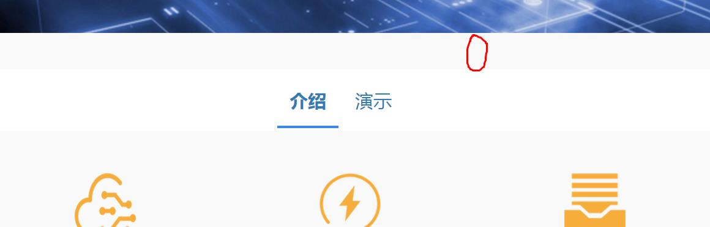
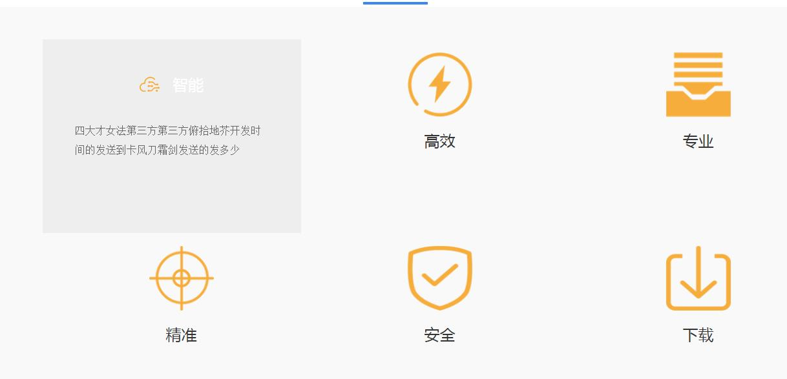
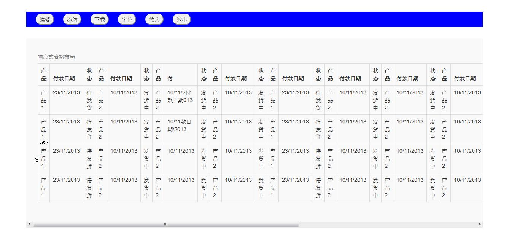
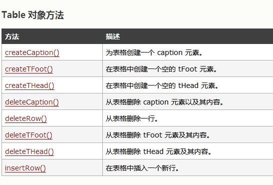
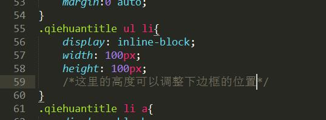
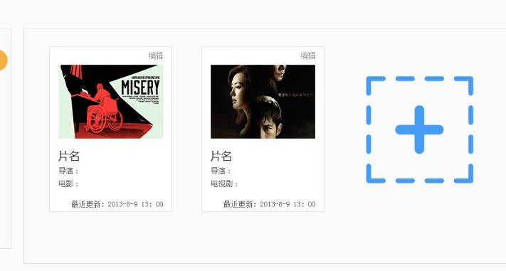
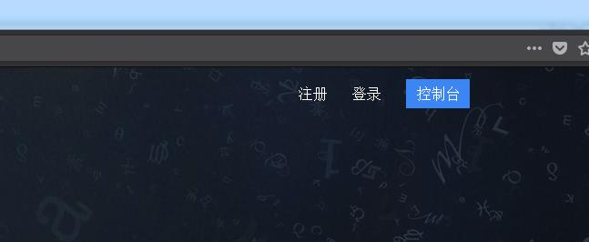

# 北京非幕文化科技————非幕项目
<h2>时间：2018年4月19日</h2>

解决bug和完成任务：

	<ol>
		<li>介绍里面每一个项的特效，点击下面出现通栏</li>
		<li>介绍和演示的特效切换</li>
		<li>介绍下面的边框位置</li>
		<li>head_top里面图标与文字没有垂直居中对齐</li>
		<li>把背景图片改为实质图片</li>
		<li>浏览器窗口缩小的时候页面的右边出现白色空白</li>
	</ol>

<h2>时间：2018年4月20日</h2>

解决bug和完成任务：

	<ol>
		<li>[已解决]浏览器窗口缩小的时候页面的右边出现白色空白 
			解决思路：对最外层的div添加overflow-x:hidden 
			参考文章： 
			1.1<a href="https://www.zhihu.com/question/36208082">知乎上查找网页留白</a> 
			1.2<a href="https://github.com/xujinglian/feimu/invitations">缩小窗口时CSS背景图出现右侧空白BUG的解决方法</a> 
			1.3<a href="https://blog.csdn.net/gyy93/article/details/70905405">缩小浏览器窗口右边出现空白</a>
		</li>
		<li>[已解决]产品特色板块在缩小窗口的时候左右不平等，与上面的动画板块出现排版问题 
			解决思路：整体特色板块的内容与动画板块的尺寸不对，下面是1450，重新调整特色板块的整体尺寸和每一个li板块的尺寸。
		</li>
		<li>[已解决]为页面添加响应式插件，解决页面缩小时统筹机器人大图片的缩放问题。 解决思路：为页面添加了BS</li>
		<li>[已解决]介绍演示触碰定位效果 解决思路：JS脚本</li>
		<li>介绍里面每一个项的特效，点击下面出现通栏 解决思路：参考百度AI的页面</li>
		<li>介绍演示触碰定位效果的兼容性</li>
		<li>页面footer内容改为特色样式</li>
		<li>屏幕分辨率适配问题</li>
		<li>动画板块火狐浏览器的兼容</li>
	</ol>

<h2>时间：2018年4月23日02:19</h2>

解决bug和完成任务:

	<ol>
		<li>演示出来效果</li>
		<li>UI图库有更新，网站整体颜色发生变动</li>
		<li>添加库文件文件夹</li>
		<li>添加测试demo模块，用来对有难度的板块分块demo处理</li>
	</ol>

<h2>时间：2018年4月24日</h2>

解决bug和完成任务：

	<ol>
		<li>为首页整体添加响应式布局框架</li>
		<li>对首页顶部head_top进行bug处理，让它在页面缩小的时候不至于出现左边的空白比右边大，造成不居中的显示效果，现在它可以在浏览器窗口缩小的状态下也能适应的居中布局，兼容性页通过</li>
		<li>为首页整体添加响应式布局框架之后的超链接状态的处理</li>
		<li>介绍选项下的六种介绍添加了页面响应式</li>
		<li>首页短片部分添加页面响应式，解决了添加响应式之后后两栏左边出现白色空白bug</li>
		<li>产品特色的五种介绍添加响应式，适应浏览器窗口缩小的时候出现的变得特别大，影响美观度，目前浏览器缩小之后内容两边也会有相应大小的留白</li>
		<li>footer情况和产品特色一样，添加了响应式效果</li>
	</ol>

<h2>时间：2018年4月25日</h2>

解决bug和完成任务：

	<ol>
		<li>演示页效果完成。</li>
		<li>添加UI首页产品遮罩层图片</li>
		<li>待解决：演示页随机示例部分</li>
	</ol>

<h2>时间：2018年4月26日</h2>

解决bug和完成任务：

	<ol>
		<li>首页介绍产品遮罩板块demo完成</li>
		<li>产品遮罩板块加入首页</li>
		<li>把演示页demo与首页融合，创建独立yanshi.html页面，原先的切换效果用锚点方式表现。</li>
		<li><strong>[待解决]</strong>yanshi.html的细节。</li>
		<li>把页面footer的css移出来创建footer.css,方便调用</li>
		<li>把页面重置css的部分移出来创建reset.css,方便调用</li>
		<li>添加xiangqing.css文件</li>
		<li>添加yanshi.css文件</li>
		<li>添加UI详情页部分</li>
		<li>详情页完成</li>
		<li>列表页完成</li>
		<li>[待解决]列表页的功能板块（bootstrap可编辑表格）</li>
		<li>[待解决]演示页的随机示例部分</li>
		<li>[待解决]介绍演示导航部分上面的出现的空白区域</li>
		<li>整体UI图库文件</li>
	</ol>

<h2>时间：2018年4月27日</h2>

解决bug和完成任务：

	<ol>
		<li>[待解决]优化代码（css和html、完善注释）</li>
		<li>[待解决]演示页样式的细节完善</li>
		<li>[待解决]首页和演示页的导航位置调整</li>
		<li>[待解决]首页产品介绍板块的样式调整，高度改为min-height，现在的高度有点高 
			</li>
		<li>[待解决]对目前阶段项目程序做复盘</li>
		<li>[待解决]列表页功能板块需要做修改</li>
		<li>现有页面之间的跳转关系搭建完成</li>
		<li>个人设置页做了一部分，剩余点击用户头像显示卡片部分</li>
	</ol>

<h2>时间：2018年4月28日</h2>

解决bug和完成任务：

	<ol>
		<li>做可编辑表格demo[思路：Bootstrap可编辑表格、jquery可编辑表格、可编辑表格插件]</li>
	</ol>

<h2>时间：2018年5月2日</h2>

解决bug和完成任务：

	<ol>
		<li>可编辑表格功能</li>
		<li>首页新手引导</li>
		<li>个人设置页、密码页完善</li>
		<li>代码优化</li>
		<li>更换图标、字体</li>
		<li>列表页新建图标添加超链接</li>
		<li>详情页图标切换</li>
		<li>页面细节修改</li>
	</ol>

<h2>时间：2018年5月3日</h2>

解决bug和完成任务：

	<ol>
		<li>可编辑表格demo</li>
		<li>JavaScript电子表格——最受欢迎的Web应用程序组件</li>
	</ol>

<h2>时间：2018年5月3日</h2>

解决bug和完成任务：

	<ol>
		<li>可编辑表格：智表、spreadjs、<a href="https://handsontable.com/">JavaScript Spreadsheet</a>、下载下来直接在excel里面修改、单个功能</li>
		<li>个人设置页与密码页的左侧板块细节调整</li>
		<li>个人设置页与密码页保存设置提交按钮的苹果浏览器兼容性bug修复(按钮下边的内边距消失，换用按钮背景图片)</li>
		<li>UI增加设置密码页、注册页、登录页</li>
	</ol>

<h2>时间：2018年5月7日</h2>

解决bug和完成任务：

	<ol>
		<li>注册框demo完成，接入到首页，有一些细节样式需要调整。</li>
		<li>使用仿站工具宕腾讯文档和石墨文档，不行</li>
		<li></li>
	</ol>

<h2>时间：2018年5月8日</h2>

解决bug和完成任务：

	<ol>
		<li>编辑属性contentEditable=true，实现表格的可编辑，值为flase不可编辑</li>
		<li>【阅读文章】<a href="https://blog.csdn.net/woshimaijunjinzhen/article/details/8497964">html contentEditable属性</a></li>
		<li>【阅读文章】<a href="https://blog.csdn.net/u014516981/article/details/51824607">浅谈 css的zoom属性（只有IE支持）</a>——用于放大缩小特效</li>
	</ol>

<h2>时间：2018年5月9日</h2>

需要解决bug汇总：

	<ol>
		<li>优化代码——（1）代码的可重用行；（2）没有作用的代码。</li>
		<li>演示页——附导航</li>
		<li>个人设置——头像设置退出浮框</li>
		<li>首页——（1）介绍演示下边框颜色、位置；（2）新手引导添加；（3）注册、登录框（表单验证）</li>
		<li>（3）中间导航栏细节调整；（4）下载功能</li>
		<li>新出待完成页面：（1）新建项目页；（2）新手引导页。</li>
	</ol>

解决bug进展：

	<ol>
		<li>首页——（1）介绍演示下边框颜色、位置；</li>
		<li>首页——（2）新手引导添加；</li>
		<li>详情页——（1）功能区域改版调整；</li>
		<li>列表页样式调整</li>
		<li>个人设置——头像设置退出浮框</li>
		<li>详情页——（3）中间导航栏细节调整</li>
	</ol>

<h2>时间：2018年5月10日</h2>

解决bug和完成任务：

	<ol>
		<li>详情页——（2）左侧图标鼠标以上切换； 备注：把js效果改为css特效，添加背景色</li>
		<li>改版列表页左侧导航</li>
		<li>底部版权板块调整</li>
	</ol>

<h2>时间：2018年5月11日</h2>

解决bug和完成任务：

	<ol>
		<li>新建项目页</li>
		<li>优化代码</li>
		<li>附着导航demo</li>
		<li>异步提交表单</li>
		<li>json数据接口demo</li>
	</ol>

<h2>时间：2018年5月12日</h2>

解决bug和完成任务：

	<ol>
		<li>新手引导页</li>
		<li>完善表单验证demo</li>
		<li>代码优化</li>
		<li>整理web库，引入项目</li>
		<li>设置密码页</li>
	</ol>

<h2>时间：2018年5月14日</h2>

解决bug和完成任务：

	<ol>
		<li>首页短片部分遮罩层字体下划线去掉</li>
		<li>注册登录与控制台的水平平衡</li>
		<li>介绍板块补充,样式调整</li>
		<li>首页样式调整</li>
		<li>个人设置页、密码安全页需要重新编写样式</li>
	</ol>

<h2>时间：2018年5月15日</h2>

解决bug和完成任务：

	<ol>
		<li>首页动画板块图片更换</li>
		<li>首页注册框重新排版</li>
		<li>随机示例demo</li>
		<li>微信第三方登录暂时搁置</li>
		<li>个人设置页重新排版</li>
	</ol>

<h2>时间：2018年5月16日</h2>

解决bug和完成任务：

	<ol>
		<li>json表格demo</li>
	</ol>

<h2>时间：2018年5月17日</h2>

解决bug和完成任务：

	<ol>
		<li>用户指南页面</li>
		<li>json表格——外部json数据文件引入</li>
		<li></li>
	</ol>

<h2>时间：2018年5月18日</h2>

解决bug和完成任务：

	<ol>
		<li>UI整理</li>
		<li>所有页面底部版权内容更换，并与用户指导页面衔接跳转</li>
		<li>首页、个人设置、密码安全等页面UI调整</li>
	</ol>

<h2>时间：2018年5月19日</h2>

解决bug和完成任务：

	<ol>
		<li>整理前端页面之间的跳转逻辑</li>
	</ol>

<h2>时间：2018年5月21日</h2>

解决bug和完成任务：

	<ol>
		<li>图片上传预览插件</li>
		<li>文件上传接口对接</li>
		<li>新建项目页面整理布局、修改</li>
		<!-- <li>这是首次和后端进行对接，之前还一直担心对接的时候出现问题，主要是自己这里的问题。下午还是遇到了问题，后端帮助解决了不少，朱老师也帮助解决了不少，人多力量大。</li> -->
	</ol>

后端接口信息部分

账号：13485310921 密码：20140120

地址<a href="https://www.eolinker.com/#/home/project/inside/api/detail?groupID=-1&apiID=561361&projectName=%E9%9D%9E%E5%B9%95%E7%A7%91%E6%8A%80&projectHashKey=F952usFac3c08d2c7b11ab6ff3cdc9a63b6647581b0eb52">链接地址</a>

<h2>时间：2018年5月22日</h2>

解决bug和完成任务：

	<ol>
		<li>注册登录接口</li>
		<li>个人设置页</li>
		<li>联系我们页</li>
		<li>页面跳转补充完善</li>
		<li>梳理复盘</li>
		<li>底部版权footer的css部分优化</li>
	</ol>

<h2>时间：2018年5月23日</h2>

解决bug和完成任务：

	<ol>
		<li>上传表单美化</li>
	</ol>

<h2>时间：2018年5月24日</h2>

解决bug和完成任务：

	<ol>
		<li>注册登录弹出框</li>
		<li>手机注册、邮箱注册Tab选项卡</li>
		<li>整体梳理</li>
	</ol>

<h2>时间：2018年5月25日</h2>

解决bug和完成任务：

	<ol>
		<li>演示页附着导航</li>
		<li>弹出框</li>
		<li>表单验证</li>
		<li>整理Bug</li>
	</ol>

<h2>时间：2018年5月26日</h2>

解决bug和完成任务：

	<ol>
		<li>用户指导页面锚点跳转</li>
		<li>页面排版重新构思，解决页面比例问题</li>
	</ol>

<h2>时间：2018年5月28日</h2>

解决bug和完成任务：

	<ol>
		<li>所有的页面跳转连接起来</li>
		<li>密码安全页重新排版</li>
		<li>个人设置页重新排版</li>
		<li>详情页重新排版</li>
		<li>列表页重新排版</li>
		<li>新建项目页重新排版</li>
		<li>LOGO跳转到首页（除首页和演示页）</li>
		<li>项目编辑页面完成</li>
	</ol>

<h2>时间：2018年5月29日</h2>

解决bug和完成任务：

	<ol>
		<li>列表页细节修改</li>
		<li>文件上传接口</li>
	</ol>

 

<h2>时间：2018年5月30日</h2>

解决bug和完成任务：

	<ol>
		<li>详情页最左侧图标提示</li>
		<li>登录注册UI部分<ul><li>这里的内容包括两部分：弹出框和Tab切换</li><li>弹出框：<a href="http://www.runoob.com/bootstrap/bootstrap-modal-plugin.html">使用的是Bootstrap的模态框插件</a>，之前的弹出框一个是通过Jquery实现，一个是借鉴慕课网课程中的遮罩层的效果，但是后来发现前一个的确可以做出弹出框效果，但是登录和注册按钮弹出的内容都是A，本质上登录应该弹出A，那么注册就应该弹出B，所以这个方法不行，后一种也可以实现弹出框的效果，点击除框之外的遮罩层也可以关闭弹出框，但是里面的内容都是图片格式，并且内容都是通过JS去生成节点，实现起来比较麻烦</li></ul>最终找到BS的模态框来实现，登录弹出A，注册弹出B，点击遮罩区域也可以关闭弹出框</li>
		<li></li>
	</ol>

<!-- <h2>时间：</h2>

解决bug和完成任务：

	<ol>
		<li></li>
		<li></li>
		<li></li>
	</ol>

 -->
 

<!-- <h2>时间：</h2>

解决bug和完成任务：

	<ol>
		<li></li>
		<li></li>
		<li></li>
	</ol>

 -->
 

<!-- <h2>时间：</h2>

解决bug和完成任务：

	<ol>
		<li></li>
		<li></li>
		<li></li>
	</ol>

 -->

<!-- <h2>时间：</h2>

解决bug和完成任务：

	<ol>
		<li></li>
		<li></li>
		<li></li>
	</ol>

 -->
 

<!-- <h2>时间：</h2>

解决bug和完成任务：

	<ol>
		<li></li>
		<li></li>
		<li></li>
	</ol>

 -->

<!-- <h2>时间：</h2>

解决bug和完成任务：

	<ol>
		<li></li>
		<li></li>
		<li></li>
	</ol>

 -->

<!-- <h2>时间：</h2>

解决bug和完成任务：

	<ol>
		<li></li>
		<li></li>
		<li></li>
	</ol>

 -->
 

<!-- <h2>时间：</h2>

解决bug和完成任务：

	<ol>
		<li></li>
		<li></li>
		<li></li>
	</ol>

 -->

<!-- <h2>时间：</h2>

解决bug和完成任务：

	<ol>
		<li></li>
		<li></li>
		<li></li>
	</ol>

 -->
 

<!-- <h2>时间：</h2>

解决bug和完成任务：

	<ol>
		<li></li>
		<li></li>
		<li></li>
	</ol>

 -->
 

<!-- <h2>时间：</h2>

解决bug和完成任务：

	<ol>
		<li></li>
		<li></li>
		<li></li>
	</ol>

 -->

<!-- <h2>时间：</h2>

解决bug和完成任务：

	<ol>
		<li></li>
		<li></li>
		<li></li>
	</ol>

 -->

<!-- <h2>时间：</h2>

解决bug和完成任务：

	<ol>
		<li></li>
		<li></li>
		<li></li>
	</ol>

 -->

<!-- <h2>时间：</h2>

解决bug和完成任务：

	<ol>
		<li></li>
		<li></li>
		<li></li>
	</ol>

 -->

 